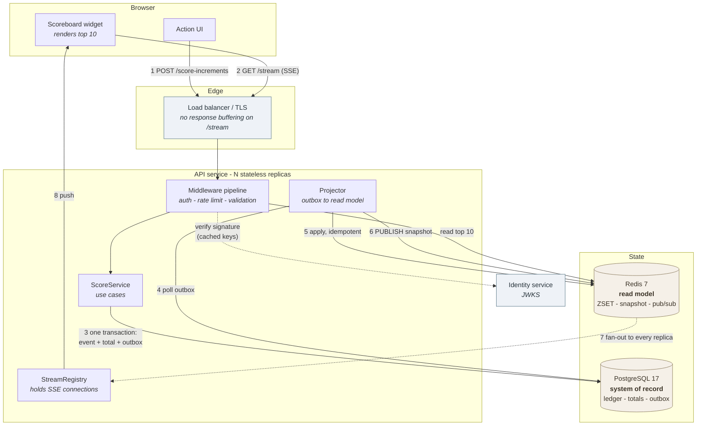
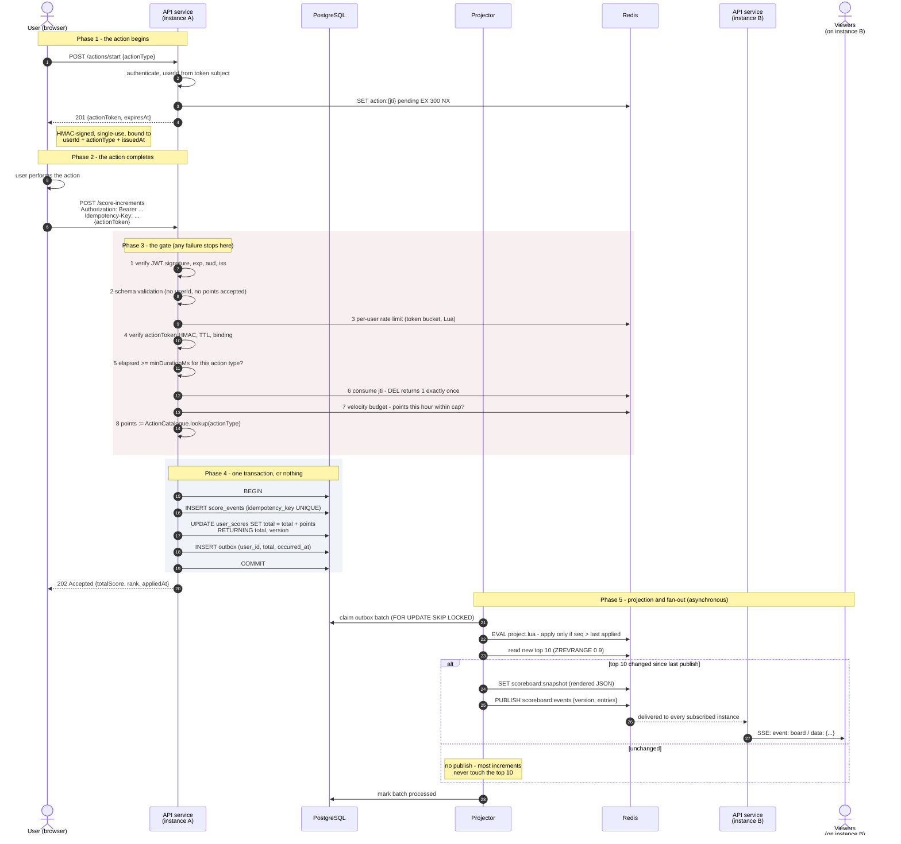
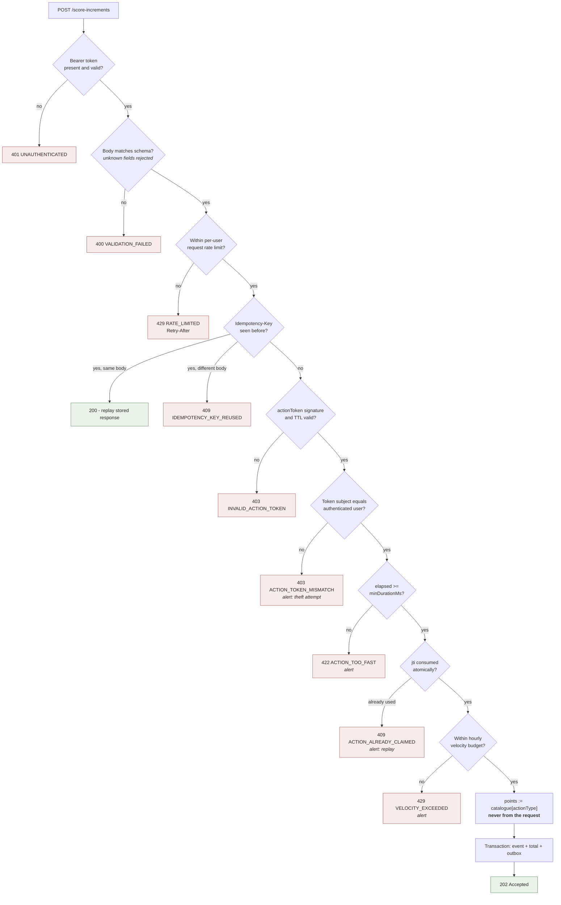
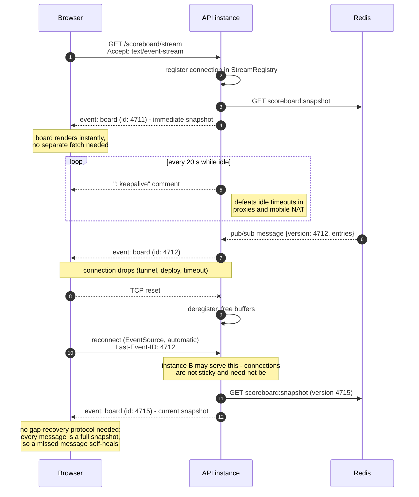

# Problem 6 — Scoreboard Module

**Specification for implementation.** This document is the contract between the
brief and the engineering team that will build the module. It is written to be
implementable without further clarification: every endpoint, table, key, script
and failure mode below is normative unless explicitly marked as an option.

> **Task:** Write the specification for a software module on the API service.
> Create documentation on a `README.md`, a diagram illustrating the flow of
> execution, and additional comments for improvement. The specification will be
> given to a backend engineering team to implement.

> **Software requirements**
> 1. A website with a score board showing the top 10 users' scores.
> 2. Live update of the score board.
> 3. A user completes an action (the action itself is out of scope); completing
>    it increases that user's score.
> 4. On completion, the action dispatches an API call to the application server
>    to update the score.
> 5. Malicious users must be prevented from increasing scores without
>    authorisation.

| | |
|---|---|
| **Module name** | `scoreboard` |
| **Owns** | Score ledger, score totals, ranking read model, live board delivery |
| **Does not own** | User identity, the action itself, the website |
| **Runtime** | Node.js 20 + TypeScript, Express 5 — same stack as [Problem 5](../problem5) |
| **Stores** | PostgreSQL 17 (system of record), Redis 7 (read model + transport) |
| **Status** | Specification. No implementation is delivered; that is the team's work. |

**Contents** — [The finding](#1-the-finding-that-shapes-this-design) ·
[Scope](#2-scope-and-boundaries) · [Architecture](#3-architecture) ·
[Execution flow](#4-execution-flow) · [API](#5-api-contract) ·
[Data model](#6-data-model) · [Live updates](#7-live-updates) ·
[Security](#8-security) · [Failure](#9-failure-modes-and-degradation) ·
[Performance](#10-performance-budget) · [Observability](#11-observability) ·
[Definition of done](#12-definition-of-done) · [Delivery](#13-delivery-plan) ·
[Improvements](#14-comments-for-improvement)

Supporting documents:

| Document | Contents |
|----------|----------|
| [`docs/DECISIONS.md`](docs/DECISIONS.md) | 12 architecture decision records — the options considered and why each was rejected |
| [`docs/THREAT_MODEL.md`](docs/THREAT_MODEL.md) | STRIDE analysis, attack tree, threats with controls and residual risk |
| [`docs/IMPROVEMENTS.md`](docs/IMPROVEMENTS.md) | Prioritised improvements, explicit non-goals, open questions for the product owner |
| [`docs/openapi.yaml`](docs/openapi.yaml) | Machine-readable contract — the normative source for request and response shapes |

---

## 1. The finding that shapes this design

**Requirements 4 and 5 are in tension, and the tension cannot be fully resolved
at the API layer. Everything else in this document follows from that.**

Requirement 4 says the client dispatches an API call when the action completes.
Requirement 5 says unauthorised score increases must be prevented. But if the
client is the party that announces "the action finished", then authentication
answers the wrong question. It proves *who is calling*. It does not prove *that
the action happened*.

A user who legitimately holds a valid session can open the browser's network
tab, copy the request, and replay it in a loop. Every request is authenticated.
Every request is from the real user. Every request is fraudulent. No signature
scheme, no token, no TLS configuration and no rate limit fixes this, because
nothing on the client can hold a secret from the person operating the client.

So this specification treats requirement 5 as two separate problems:

| Problem | Solvable at the API layer? | How this spec addresses it |
|---|---|---|
| **A. Someone increases *another* user's score, or invents a score increase from nothing** | **Yes, completely** | The user is taken from the verified token subject and never from the request. The point value is taken from a server-side table and never from the request. §8.1–8.2 |
| **B. The legitimate user replays or automates their own action** | **No — only raised in cost** | Single-use action tokens, minimum plausible duration, idempotency, per-user velocity budgets, anomaly detection, a reversible ledger. §8.3–8.7 |

Problem A is closed. Problem B is *mitigated*, and the residual risk is stated
plainly rather than hidden behind the controls: **a determined user who drives
the real action flow programmatically will still score.** The only complete fix
is architectural — the server must own the outcome of the action, not merely be
notified of it (§14.1). That is outside this module's stated scope, so it is
specified as the recommended follow-up rather than silently assumed.

Writing this down is the point. A spec that lists five security controls and
implies the problem is solved will get someone hurt later, when a product
decision is made on the assumption that scores are trustworthy.

---

## 2. Scope and boundaries

### In scope

1. Accepting authenticated, authorised, idempotent score increments.
2. Maintaining an append-only ledger of every score change, and a materialised
   total per user.
3. Serving the top 10 with a stable, well-defined ordering.
4. Pushing the board to connected clients within one second of a change.
5. The authorisation, anti-replay and anti-abuse controls in §8.
6. Serving a caller their own rank, which is the first thing a user asks after
   seeing they are not in the top 10.

### Out of scope

| Not owned | Why, and what the module assumes instead |
|-----------|------------------------------------------|
| User registration, login, password handling | Assumed to exist. The module consumes JWTs issued by the identity service and needs only its public JWKS. |
| The action itself | Explicitly excluded by the brief. The module receives a completion signal and an action type. |
| The website / rendering | The module serves JSON and an event stream. |
| Score decreases, resets, seasons | Not requested. The ledger makes all three possible later without a migration (§14.4). |
| Multiple leaderboards, per-region boards | Not requested. The key naming in §6.3 leaves room (`scoreboard:{scope}`). |

### Assumptions requiring confirmation

These are stated as assumptions rather than guessed at silently. Each has a
default the team may implement against if no answer arrives; each is also listed
in [`docs/IMPROVEMENTS.md`](docs/IMPROVEMENTS.md).

| # | Assumption | Default taken |
|---|-----------|---------------|
| A1 | The board is **public** — the top 10 is visible to anonymous visitors | Public. This materially simplifies stream authentication (§7.4). |
| A2 | Scores only ever **increase**, and never reset | Monotonic increase. |
| A3 | Ties are broken by **who reached the score first** | Earliest wins (§6.4). |
| A4 | Expected scale: **10^5–10^6 users, 10^3 increments/second peak, 10^4–10^5 concurrent viewers** | Used for every budget in §10. |
| A5 | A display name exists and is safe to show publicly | Yes; users may opt out (§8.9). |

---

## 3. Architecture

### 3.1 Component view



### 3.2 The two rules that hold the design together

**PostgreSQL is the only system of record. Redis is a cache that can be thrown
away at any moment and rebuilt from PostgreSQL in bounded time.** If a score
exists in Redis but not in PostgreSQL, it does not exist. This makes every Redis
failure a performance incident rather than a data-loss incident, and it is the
reason the module can keep accepting writes while Redis is down.

**Writes go to PostgreSQL only; the read model is updated asynchronously by a
projector reading a transactional outbox.** Writing to both stores inside the
request handler is a dual write: PostgreSQL commits, the Redis call fails, and
the two disagree with nothing to reconcile them. The outbox makes the read-model
update part of the same transaction as the score change, so the projector can be
retried until it succeeds. See [ADR-004](docs/DECISIONS.md#adr-004-transactional-outbox-rather-than-a-dual-write).

### 3.3 Internal structure

The module follows the layering already established in Problem 5 — dependencies
point inwards, and `domain/` and `application/` do not know that PostgreSQL,
Redis or Express exist.

```
src/problem6/
├── domain/scoreboard/
│   ├── ScoreEvent.ts              entity: an immutable award
│   ├── UserScore.ts               entity: a materialised total
│   ├── ActionCatalogue.ts         action type → points. The server's authority.
│   ├── ScoreLedger.ts             INTERFACE — write side
│   └── ScoreboardReadModel.ts     INTERFACE — read side
├── application/scoreboard/
│   ├── RecordScoreIncrement.ts    use case: the write path
│   ├── GetTopScores.ts            use case: the board
│   ├── GetUserRank.ts             use case: "where am I?"
│   └── ProjectOutbox.ts           use case: outbox → read model
├── infrastructure/
│   ├── postgres/                  ledger impl, outbox impl, migrations
│   ├── redis/                     read model impl, Lua scripts, pub/sub
│   └── auth/                      JWKS client, action-token signer
├── interfaces/http/
│   ├── controllers/               ScoreController, ScoreboardController
│   ├── middleware/                authenticate, rateLimit, velocityBudget
│   ├── schemas/                   zod schemas at the trust boundary
│   └── sse/                       StreamRegistry, heartbeat, backpressure
└── shared/                        errors, logger, clock
```

**The read model is an interface, not a Redis client passed around.** The board
must be servable from PostgreSQL when Redis is unavailable (§9.2); that is one
alternative implementation of the same interface, not a branch inside every
caller. This is Dependency Inversion applied where it actually pays — and it is
what allows the use cases to be unit-tested with an in-memory read model and no
infrastructure at all, exactly as `InMemoryProductRepository` does in Problem 5.

**`ActionCatalogue` is a domain object, not a constant map inside a
controller.** It is the single place that answers "how many points is this
action worth", and that question is the entire defence against a client sending
its own point value. Isolating it makes it testable, auditable and versionable.

**The projector is a use case, not a script.** It runs in-process on every
replica by default (leader-elected via a Redis lock so only one is active), and
can be extracted into its own deployable without code changes because it depends
only on the two interfaces. That extraction is the first thing to do if
projection lag becomes the bottleneck (§14.3).

---

## 4. Execution flow

### 4.1 The main flow — action completion to live board

This is the required flow-of-execution diagram. The numbered steps are normative
and are referenced elsewhere in this document.



**Why the response is `202 Accepted` and not `200 OK`.** At the moment the API
responds, the score is durably committed but the *board* has not necessarily
been updated — the projector runs asynchronously. `202` states that accurately.
The response still carries the caller's authoritative new total, read back from
the write transaction, so the user's own UI updates immediately and correctly.
Claiming `200 OK` would imply a system-wide consistency the design deliberately
does not provide. See [ADR-009](docs/DECISIONS.md#adr-009-202-accepted-rather-than-200-ok).

### 4.2 The gate, as a decision tree

Every rejection path in phase 3, with its status code. The order is not
arbitrary: each check is placed so that the cheapest and most conclusive
rejections happen before the module spends effort on the request.



**Rate limiting sits before the idempotency lookup and token verification**
deliberately: those are the steps that touch storage and do cryptographic work.
A client already over budget should not get to make the server spend that
effort first. This mirrors the middleware ordering argued in Problem 5.

### 4.3 The live stream lifecycle



**Every broadcast is a complete snapshot of the top 10, never a delta.** This is
the single decision that removes most of the complexity from live updates. Redis
Pub/Sub is at-most-once — a message is lost during a failover, or to a slow
subscriber — and a delta stream would then be permanently wrong with no way to
detect it. A snapshot stream repairs itself on the very next broadcast. It also
makes reconnection trivial, makes instances interchangeable, and makes the
client a pure function of the last message it received. The payload is ten rows;
there is nothing to save by sending deltas. See
[ADR-006](docs/DECISIONS.md#adr-006-broadcast-full-snapshots-not-deltas).

---

## 5. API contract

Base path `/api/v1`. The normative machine-readable definition is
[`docs/openapi.yaml`](docs/openapi.yaml); this section is its commentary.

| Method | Path | Auth | Purpose |
|--------|------|------|---------|
| `POST` | `/actions/start` | required | Begin an action; mint a single-use action token |
| `POST` | `/score-increments` | required | Report completion; award points |
| `GET` | `/scoreboard/top` | none (A1) | Current top 10, cacheable |
| `GET` | `/scoreboard/stream` | none (A1) | Live board over SSE |
| `GET` | `/scoreboard/me` | required | The caller's own score and rank |

Five endpoints, and each exists because the flow above needs it. There is no
`PUT /scores/{userId}`: an endpoint that sets a score by user id is precisely
the shape requirement 5 exists to prevent, and it must not appear even as an
internal convenience — internal endpoints leak.

### 5.1 `POST /actions/start`

```http
POST /api/v1/actions/start
Authorization: Bearer <access-token>
Content-Type: application/json

{ "actionType": "daily_challenge" }
```

```http
HTTP/1.1 201 Created
Content-Type: application/json

{
  "actionToken": "v1.eyJqdGkiOiIwMWo5...ZDQifQ.9f2c1a...",
  "actionType": "daily_challenge",
  "expiresAt": "2026-09-07T10:35:00.000Z",
  "minDurationMs": 3000
}
```

The token is opaque to the client. Internally it is a versioned, HMAC-SHA-256
signed structure binding `jti`, `sub` (the user), `actionType` and `issuedAt`
(§8.3). `minDurationMs` is returned so an honest client can avoid a pointless
rejection; it is enforced server-side regardless, and the client's copy is
advisory only.

### 5.2 `POST /score-increments`

The core endpoint.

```http
POST /api/v1/score-increments
Authorization: Bearer <access-token>
Idempotency-Key: 018f3a2b-7c4e-7a91-9f3c-2b5d8e1a4c60
Content-Type: application/json

{ "actionToken": "v1.eyJqdGkiOiIwMWo5...ZDQifQ.9f2c1a..." }
```

**Note what the request body does not contain: no `userId`, and no `points`.**

The user is the `sub` claim of the verified access token. The points are looked
up from the server-side `ActionCatalogue` using the action type inside the
signed action token. A request that includes either field is rejected with
`400 VALIDATION_FAILED` rather than having the field ignored — silently dropping
an unknown field trains clients to send it and hides a probing attacker in the
noise. This is the same unknown-field policy Problem 5 applies, used here for a
sharper reason: it is the mass-assignment defence on the one endpoint where mass
assignment would be worth money.

```http
HTTP/1.1 202 Accepted
Content-Type: application/json
RateLimit-Remaining: 58

{
  "userId": "018f3a2b-...",
  "pointsAwarded": 50,
  "totalScore": 1350,
  "rank": 7,
  "appliedAt": "2026-09-07T10:34:12.481Z",
  "boardVersion": 4712
}
```

`totalScore` is authoritative — returned by the `UPDATE ... RETURNING` inside
the transaction. `rank` is best-effort: it is read from the read model, which
may lag the write by the projector's latency (§10.2). The distinction is
documented rather than smoothed over, because a client that renders `rank` as
though it were transactional will show users a number that briefly disagrees
with the board.

**Idempotency.** `Idempotency-Key` is **required**, and must be a UUID. The key
is stored with a hash of the request body and the resulting response for 24
hours. A repeat with the same key and the same body replays the stored response
with `200` and `Idempotency-Replayed: true`. A repeat with the same key and a
*different* body is `409` — that is a client bug or an attack, never a
legitimate retry. Without this, every network timeout on a mobile connection
becomes either a lost point or a double award, and the client cannot tell which.
See [ADR-008](docs/DECISIONS.md#adr-008-idempotency-key-is-required-not-optional).

### 5.3 `GET /scoreboard/top`

```http
GET /api/v1/scoreboard/top
```

```http
HTTP/1.1 200 OK
Cache-Control: public, max-age=1, stale-while-revalidate=5
ETag: "4712"

{
  "version": 4712,
  "generatedAt": "2026-09-07T10:34:12.500Z",
  "entries": [
    { "rank": 1, "userId": "018f...", "displayName": "kaya", "score": 9820 },
    { "rank": 2, "userId": "018e...", "displayName": "tuan", "score": 9105 }
  ]
}
```

A single Redis `GET` of a pre-rendered snapshot — the projector serialises the
board once per change, so a read never sorts, never joins and never touches
PostgreSQL. `ETag` is the board version, so a conditional request costs a `304`
with no body. The one-second `max-age` lets a CDN absorb an arbitrary number of
anonymous viewers at the cost of at most one second of staleness, which is
inside the "live" requirement's tolerance.

This endpoint exists alongside the stream because it is the correct fallback for
clients that cannot hold a connection, the correct target for a CDN, and the
correct source for a server-rendered first paint.

### 5.4 `GET /scoreboard/stream`

```http
GET /api/v1/scoreboard/stream
Accept: text/event-stream
```

```
retry: 3000

id: 4711
event: board
data: {"version":4711,"entries":[...]}

: keepalive

id: 4712
event: board
data: {"version":4712,"entries":[...]}
```

The first `board` event is sent immediately on connect, so a client needs no
separate fetch to render.

`retry: 3000` sets the client's reconnection delay. **Implementations must
jitter this value ±20% per connection**, or a deploy that drops 20,000
connections will bring them all back inside the same 50 ms window and knock the
new instance over as it starts. This is a self-inflicted thundering herd, it is
easy to forget, and it only ever shows up in production.

Required response headers: `Content-Type: text/event-stream`,
`Cache-Control: no-store`, `Connection: keep-alive`, and
`X-Accel-Buffering: no` — the last because a buffering reverse proxy will hold
events until its buffer fills, and the "live" board will then update in bursts
of nothing followed by everything.

### 5.5 `GET /scoreboard/me`

Returns the caller's own total and rank, plus the neighbours immediately above
and below. Rank is `ZREVRANK`, O(log N). The neighbours cost one extra range
read and answer the only question the user actually has, which is how far away
the next place is.

### 5.6 Errors

Errors reuse Problem 5's convention exactly: RFC 9457 `application/problem+json`
with a **stable machine-readable `code`**. Clients branch on `code`, never on
prose, and a `code` may not be reworded once published.

| Status | Codes |
|--------|-------|
| 400 | `VALIDATION_FAILED`, `MALFORMED_JSON`, `IDEMPOTENCY_KEY_MISSING` |
| 401 | `UNAUTHENTICATED`, `TOKEN_EXPIRED` |
| 403 | `INVALID_ACTION_TOKEN`, `ACTION_TOKEN_MISMATCH`, `ACCOUNT_SUSPENDED` |
| 404 | `USER_NOT_FOUND`, `ROUTE_NOT_FOUND` |
| 409 | `ACTION_ALREADY_CLAIMED`, `IDEMPOTENCY_KEY_REUSED` |
| 415 | `UNSUPPORTED_MEDIA_TYPE` |
| 422 | `ACTION_TOO_FAST`, `UNKNOWN_ACTION_TYPE` |
| 429 | `RATE_LIMITED`, `VELOCITY_EXCEEDED` |
| 503 | `WRITE_UNAVAILABLE` (PostgreSQL down — §9.1) |

Error responses must never echo the submitted action token back, and must not
distinguish "this token was never issued" from "this token is malformed" — both
are reconnaissance. As in Problem 5, an unrecognised internal failure becomes a
`500` whose details are logged against the `requestId` and never returned:
driver errors carry table names, SQL fragments and sometimes row values.

---

## 6. Data model

### 6.1 PostgreSQL — the system of record

Written as hand-authored, reversible migrations. `synchronize` stays `false`
permanently and migrations are a deployment step, never run on process boot —
the same policy as Problem 5, for the same reason: N replicas racing to migrate
during a rolling deploy is a bad way to find out.

```sql
-- An append-only ledger. One row per award, never updated, never deleted.
CREATE TABLE score_events (
    id                UUID        PRIMARY KEY,
    user_id           UUID        NOT NULL REFERENCES users(id),
    action_type       TEXT        NOT NULL,
    points            INTEGER     NOT NULL CHECK (points > 0 AND points <= 100000),
    idempotency_key   UUID        NOT NULL,
    action_token_jti  UUID        NOT NULL,
    catalogue_version INTEGER     NOT NULL,
    request_id        UUID        NOT NULL,
    client_ip_hash    BYTEA,          -- hashed, not stored raw: see §8.9
    occurred_at       TIMESTAMPTZ(3) NOT NULL DEFAULT now(),

    CONSTRAINT uq_score_events_idempotency UNIQUE (user_id, idempotency_key),
    CONSTRAINT uq_score_events_jti         UNIQUE (action_token_jti)
);

CREATE INDEX ix_score_events_user_time ON score_events (user_id, occurred_at DESC);
CREATE INDEX ix_score_events_time      ON score_events (occurred_at DESC);

-- The materialised total. Derivable from the ledger, kept for read speed.
CREATE TABLE user_scores (
    user_id      UUID        PRIMARY KEY REFERENCES users(id),
    total_score  BIGINT      NOT NULL DEFAULT 0 CHECK (total_score >= 0),
    reached_at   TIMESTAMPTZ(3) NOT NULL DEFAULT now(),  -- when this total was reached
    version      INTEGER     NOT NULL DEFAULT 0,
    is_visible   BOOLEAN     NOT NULL DEFAULT TRUE,       -- opt-out, §8.9
    updated_at   TIMESTAMPTZ(3) NOT NULL DEFAULT now()
);

CREATE INDEX ix_user_scores_board
    ON user_scores (total_score DESC, reached_at ASC)
    WHERE is_visible;

-- The outbox. Written in the same transaction as the score change.
CREATE TABLE scoreboard_outbox (
    seq          BIGSERIAL   PRIMARY KEY,
    user_id      UUID        NOT NULL,
    total_score  BIGINT      NOT NULL,
    reached_at   TIMESTAMPTZ(3) NOT NULL,
    is_visible   BOOLEAN     NOT NULL,
    created_at   TIMESTAMPTZ(3) NOT NULL DEFAULT now(),
    processed_at TIMESTAMPTZ(3)
);

CREATE INDEX ix_outbox_unprocessed
    ON scoreboard_outbox (seq)
    WHERE processed_at IS NULL;
```

**Why both a ledger and a total.** The ledger is the truth and makes every score
explainable, auditable and — critically — *reversible*: a fraudulent run can be
undone exactly, by inserting compensating rows or recomputing the total from the
surviving events. The total exists because summing a user's whole history on
every read is not viable at 10^6 users. The total is a derived value, and the
reconciliation job in §9.4 proves it still matches the ledger.

**`CHECK (points > 0 AND points <= 100000)`** mirrors the application's
validation at the table. Validation at the edge protects against bad requests; a
constraint protects against every other path into the table — a migration, a
repair script, a `psql` session at 3am. This is the same argument Problem 5
makes, and it matters more here, because the thing being protected is the value
users are competing over.

**`UNIQUE (user_id, idempotency_key)`** is what makes idempotency real. A cache
lookup narrows the race window; a unique index closes it. Under concurrent
retries the second insert raises `23505` and the handler replays the stored
response instead of awarding twice. Uniqueness is decided by the database, never
by a prior `SELECT` — checking first and inserting second is a race, as Problem
5's SKU handling already established.

**`UNIQUE (action_token_jti)`** is the durable backstop for single-use action
tokens. Redis holds the fast path (§8.3); this holds the truth if Redis loses
the key. Two defences, at different layers, failing independently.

**`timestamptz(3)`, not the default.** PostgreSQL stores microseconds; a
JavaScript `Date` holds milliseconds. That exact mismatch produced duplicated
rows in Problem 5's paginated results, and here it would corrupt tie ordering
after a round-trip through the application. Millisecond precision on both sides
by construction.

### 6.2 The write transaction

Normative. All four statements, one transaction, or none.

```sql
BEGIN;

INSERT INTO score_events (id, user_id, action_type, points, idempotency_key,
                          action_token_jti, catalogue_version, request_id,
                          client_ip_hash, occurred_at)
VALUES ($1, $2, $3, $4, $5, $6, $7, $8, $9, now());
-- 23505 on uq_score_events_idempotency → replay the stored response (200)
-- 23505 on uq_score_events_jti         → 409 ACTION_ALREADY_CLAIMED

INSERT INTO user_scores (user_id, total_score, reached_at, version)
VALUES ($2, $4, now(), 1)
ON CONFLICT (user_id) DO UPDATE
   SET total_score = user_scores.total_score + EXCLUDED.total_score,
       reached_at  = now(),
       version     = user_scores.version + 1,
       updated_at  = now()
RETURNING total_score, reached_at, version, is_visible;

INSERT INTO scoreboard_outbox (user_id, total_score, reached_at, is_visible)
VALUES ($2, <returned total>, <returned reached_at>, <returned is_visible>);

COMMIT;
```

**The total is incremented in the database, not read-modify-written in the
application.** `SET total = total + $n` is a single atomic statement; the row
lock is held for its duration and concurrent increments serialise correctly with
no lost updates. Reading the total, adding in Node, and writing it back would
lose increments under exactly the concurrency this endpoint is built for — and
would do so silently, which is the worst property a bug can have. Problem 5's
`EC-01` is the same class of failure found the hard way; this design does not
repeat it.

Note this is *not* optimistic locking and does not need to be. `If-Match` and
version predicates exist to stop two clients overwriting each other's *absolute*
values. Here every write is a relative increment, which is commutative — so the
correct tool is an atomic in-place update, and `version` is retained only as a
monotonic marker for the read model. Applying optimistic locking here would
produce 409s for operations that are perfectly safe to interleave.

**`ON CONFLICT DO UPDATE` rather than "check then insert or update".** One
statement, no race, no branch, and it works correctly the first time a user ever
scores.

### 6.3 Redis — the read model

| Key | Type | Contents | TTL |
|-----|------|----------|-----|
| `scoreboard:global` | ZSET | member = `userId`, score = packed composite (§6.4) | none |
| `scoreboard:snapshot` | STRING | pre-rendered top-10 JSON, served verbatim | none |
| `scoreboard:version` | STRING | monotonic counter, `INCR` per publish | none |
| `scoreboard:seq:{userId}` | STRING | last outbox `seq` applied for this user | 7 d |
| `scoreboard:names` | HASH | `userId` → display name | none |
| `action:{jti}` | STRING | pending action token marker | 300 s |
| `idem:{userId}:{key}` | STRING | stored response for replay | 24 h |
| `ratelimit:{userId}:{window}` | STRING | request counter | window |
| `velocity:{userId}:{hour}` | STRING | points awarded this hour | 2 h |
| `scoreboard:events` | channel | pub/sub fan-out of the snapshot | — |

Key names carry a `scoreboard:` prefix so the module's keyspace is separable —
it can be moved to its own Redis instance, or scanned and dropped, without
touching anything else. `scoreboard:global` is deliberately named for a scope,
so a future per-region or per-season board is a new key rather than a redesign.

### 6.4 Ranking, and the tie-break

**The problem.** A ZSET orders equal scores lexicographically by member. Member
here is a UUID, so two users on 9,820 points would be ranked by the alphabet —
stable, but arbitrary and impossible to explain to a user who has just been
pushed out of the top 10 by someone with a luckier identifier. Assumption A3
says the user who reached the score *first* ranks higher, which is the rule
players expect and the only one that is defensible in public.

**The mechanism.** Pack both facts into the one double a ZSET score provides.
Redis scores are IEEE-754 doubles: integers are exact up to 2^53.

```
composite = points × 2^30  +  (2^30 − 1 − t)

  points : the user's total, 0 … 2^23 − 1   (8,388,607 max)
  t      : whole seconds since the service epoch, 0 … 2^30 − 1  (~34 years)
```

Higher points dominate. On equal points, a smaller `t` — an earlier arrival —
produces a larger composite and therefore a higher rank. Maximum value
`(2^23 − 1) × 2^30 + (2^30 − 1) < 2^53`, so every composite is exactly
representable and comparisons are exact rather than approximate.

**The limits, stated so nobody discovers them in production:**

| Limit | Value | What to do about it |
|-------|-------|---------------------|
| Maximum score | 8,388,607 | Alert at 80% (6.7M). Exceeding it corrupts the ordering silently — the worst failure mode available — so the alert is mandatory, not advisory. |
| Tie resolution | 1 second | Two users reaching the same score inside the same second fall back to lexicographic order. Acceptable; documented. |
| Epoch lifetime | ~34 years | Recorded in the runbook. |
| Remedy if a limit is reached | — | Re-split the 53 bits (e.g. 26 points / 27 time) and rebuild the ZSET from PostgreSQL — a bounded, tested operation (§9.4), not a migration. |

The alternative — plain integer scores and lexicographic ties — was rejected in
[ADR-005](docs/DECISIONS.md#adr-005-packed-composite-zset-score-for-deterministic-ties)
because "arbitrary but stable" is not a rule that survives contact with a user
who cares about rank 10.

The **authoritative** ordering, for disputes and for the reconciliation job, is
the PostgreSQL index `(total_score DESC, reached_at ASC)`, which encodes the
same rule without any bit budget. Redis is fast; PostgreSQL is right. They are
required to agree, and §9.4 checks that they do.

### 6.5 The projector, and why it is idempotent

Applying an outbox row to Redis must be safe to do twice, and safe to do out of
order. Both happen: a projector crashes after writing to Redis and before
marking the row processed, and a retry re-applies it; two projector instances
overlap briefly during a failover. The fix is a per-user sequence guard,
evaluated atomically inside Redis.

```lua
-- project.lua — KEYS[1] = scoreboard:global, KEYS[2] = scoreboard:seq:{userId}
-- ARGV = { userId, seq, composite, isVisible }
local lastSeq = tonumber(redis.call('GET', KEYS[2])) or 0
local seq = tonumber(ARGV[2])

if seq <= lastSeq then
  return 0                      -- already applied, or superseded. Do nothing.
end

if ARGV[4] == '1' then
  redis.call('ZADD', KEYS[1], tonumber(ARGV[3]), ARGV[1])
else
  redis.call('ZREM', KEYS[1], ARGV[1])   -- opted out: not on the public board
end

redis.call('SET', KEYS[2], ARGV[2], 'EX', 604800)
return 1
```

Because the guard is `seq <= lastSeq`, replaying an old row is a no-op rather
than a regression to a stale total — which is the failure that would otherwise
make a user's score visibly go *down*. The script is atomic, so two projectors
cannot interleave between the read and the write. This is the same reasoning
behind Problem 5's Lua rate limiter: `INCR` then `EXPIRE` as two round trips is
a real race, and the only fix is to make it one operation.

Outbox rows are claimed with `FOR UPDATE SKIP LOCKED` so multiple projector
workers can share the backlog without blocking each other or double-processing.
Processed rows are deleted by a nightly job with a 7-day retention window —
long enough to replay a projection incident, short enough that the table does
not become the largest thing in the database.

---

## 7. Live updates

### 7.1 Transport: SSE

**Server-Sent Events, not WebSocket.** The data flows one way — server to
client — and SSE is the protocol built for exactly that. It is plain HTTP, so
it inherits the existing TLS termination, load balancing, authentication
middleware, logging and rate limiting rather than needing a parallel stack for
all five. Reconnection with backoff is implemented by the browser. There is no
upgrade handshake to get wrong and no ping/pong framing to maintain.

WebSocket would be the right answer if the client needed to send messages on the
same connection. It does not: the only thing it sends is a score increment,
which is a request/response interaction that wants an HTTP status code, an
`Idempotency-Key` header and a retry — all of which are natural over HTTP and
all of which must be hand-built over a socket. Full comparison in
[ADR-002](docs/DECISIONS.md#adr-002-sse-rather-than-websocket-or-polling).

The known SSE limitation — six connections per origin under HTTP/1.1 — is not a
constraint here: the deployment is HTTP/2, where streams are multiplexed over
one connection and the limit does not apply. If HTTP/1.1 must be supported, the
`GET /scoreboard/top` polling path in §5.3 is the documented fallback and costs
the origin nothing behind a CDN.

### 7.2 Fan-out across instances

An SSE connection is held by exactly one instance, and a score increment can be
processed by any other. Redis Pub/Sub bridges them: the projector publishes one
message, every instance receives it, and each writes to the connections it holds.
Every instance subscribes once at boot on a **dedicated Redis connection** — a
connection in subscriber mode cannot serve normal commands, so sharing the main
client will break every other Redis call in the process.

Pub/Sub is at-most-once, which is acceptable only because every message is a
full snapshot (§4.3): a dropped message is corrected by the next one, and by the
snapshot fetched on reconnect. If the board ever needs guaranteed delivery — for
an audit feed, say — Redis Streams with consumer groups is the replacement, at
the cost of managing consumer state.

### 7.3 Broadcast throttling — the part that decides whether this scales

**Do not broadcast on every increment.** Two independent filters, both required:

1. **Change detection.** The projector compares a hash of the new top 10 against
   the last published one. At 10^3 increments/second against an established
   board, the overwhelming majority change nobody's position in the top 10 and
   must produce no traffic at all. This is the filter that does most of the
   work.
2. **Rate cap.** Even when the board genuinely is changing, publish at most
   **once per second** (configurable). The projector coalesces everything inside
   the window into one snapshot: viewers see the newest state, and the states
   they skipped were only ever going to be on screen for a few milliseconds.

The arithmetic in §10.3 shows why this is not optional. Without both filters,
egress alone makes the design unaffordable.

### 7.4 Connection handling

**Backpressure.** A slow client — a phone on a weak connection — cannot drain
the socket as fast as the server writes. `res.write()` returns `false` when the
kernel buffer is full, and a server that ignores it accumulates snapshots in
memory until the process dies. Required behaviour:

- Track bytes buffered per connection.
- On `write()` returning `false`, **stop queueing snapshots for that
  connection** and set a "needs resync" flag.
- When `drain` fires, send **one** current snapshot and clear the flag.
- If buffered bytes exceed 256 KB or the connection stays blocked for more than
  30 seconds, close it. `EventSource` will reconnect and receive a fresh
  snapshot.

Because messages are snapshots and not deltas, dropping them is always safe.
That property is what makes this policy three lines of logic instead of a
replay buffer.

**Heartbeat.** A `: keepalive` comment every 20 seconds. Idle HTTP connections
are reaped by load balancers (commonly 60 s) and by mobile carrier NAT, and
without traffic the client sees a silent hang rather than a disconnect. The
comment is two bytes on the wire and is ignored by `EventSource`.

**Limits.** A maximum concurrent connection count per instance, enforced with
`503` and `Retry-After` once reached — an instance that accepts connections past
the point where it can serve them fails all of them instead of some. Anonymous
connections are additionally capped per IP to keep one client from opening
thousands.

**Graceful shutdown.** On `SIGTERM`, send a final snapshot, then close each
connection with a jittered `retry` interval so reconnects spread over several
seconds rather than arriving together. Then drain in-flight HTTP requests and
exit — the same shutdown discipline Problem 5 already implements.

### 7.5 Authentication on the stream

Under assumption A1 the board is public, so the stream needs no authentication —
it carries exactly what the website already shows to anonymous visitors. This
avoids a real and frequently-botched problem: `EventSource` cannot set an
`Authorization` header, which pushes teams into putting a bearer token in the
query string, where it lands in access logs, proxy logs, browser history and
`Referer` headers.

If A1 is overturned and the board becomes private, the correct mechanism is
**not** a token in the URL. Either use a `fetch`-based SSE client that can set
headers, or mint a **single-use stream ticket** — 60-second TTL, bound to the
user, consumed on connect — and pass that in the query string. A leaked ticket
is then worth one connection for one minute rather than full account access.
Specified in [ADR-010](docs/DECISIONS.md#adr-010-stream-authentication-if-the-board-becomes-private).

---

## 8. Security

The threat model in [`docs/THREAT_MODEL.md`](docs/THREAT_MODEL.md) is the full
treatment: STRIDE per component, an attack tree for "increase my score without
doing the work", and residual risk per threat. This section is the set of
controls the implementation must contain.

### 8.1 Identity comes from the token, never from the request

```ts
// Correct. The only source of identity.
const userId = request.auth.subject;

// Never. Not in the body, not in a query parameter, not in a header,
// not "just for the admin path".
const userId = request.body.userId;
```

This single rule eliminates the entire class of "increase someone else's score",
and it is the rule most often broken by a convenience endpoint added later. It
is enforced in three places so that breaking it requires three mistakes: the zod
schema rejects a `userId` field outright; the service signature takes an
`AuthenticatedUser` rather than a string; and a test asserts that a request
carrying another user's id in the body is a `400` and that the other user's
score is unchanged.

**JWT verification requirements.** Asymmetric signatures only (RS256 or EdDSA),
verified against the identity service's JWKS with `kid` selection and a cached
key set. The accepted algorithm list is a **whitelist** — accepting `alg` from
the token is how `alg: none` and RS256→HS256 confusion attacks work. `iss`,
`aud`, `exp` and `nbf` all verified, with at most 60 seconds of clock skew.
Access-token lifetime ≤ 15 minutes.

### 8.2 The client never supplies the point value

The request carries an action *type*, inside a signed token. The number of
points is looked up server-side from `ActionCatalogue`, and the catalogue
version used is written into the ledger row so a later change to the point table
does not make historical awards inexplicable.

An unknown action type is `422 UNKNOWN_ACTION_TYPE`, not a default of zero
points and not a silent success. The catalogue is loaded at boot and validated;
a missing or malformed catalogue prevents the process from starting, the same
fail-fast configuration policy Problem 5 applies to credentials.

### 8.3 Action tokens — binding the award to a real flow

Without this, `POST /score-increments` is a bare "give me points" endpoint that
any authenticated user can call in a loop. The action token forces the caller
through the flow that precedes the award.

```
actionToken := "v1." + base64url(payload) + "." + base64url(HMAC-SHA256(key, payload))

payload := { jti, sub, actionType, iat, catalogueVersion }
```

Verification, in order, all mandatory:

| Check | Failure |
|-------|---------|
| Signature (constant-time comparison) | `403 INVALID_ACTION_TOKEN` |
| `iat` within TTL (default 300 s) | `403 INVALID_ACTION_TOKEN` |
| `sub` equals the authenticated user | `403 ACTION_TOKEN_MISMATCH` + alert |
| `now − iat ≥ minDurationMs` for the type | `422 ACTION_TOO_FAST` + alert |
| `jti` consumed exactly once | `409 ACTION_ALREADY_CLAIMED` + alert |
| `jti` absent from `score_events` | `409` (durable backstop) |

**Single-use is enforced by atomic consumption, not by a check followed by a
delete.** `DEL` returns the number of keys removed: exactly one caller gets `1`
and every concurrent duplicate gets `0`. A `GET` followed by a `DEL` is a race,
and the prize for winning it is double points.

**The minimum-duration check is a floor, not a heuristic.** If an action cannot
physically be completed in under three seconds, a completion reported 40 ms
after the token was issued did not happen. It catches the naive automation
attempt and it costs one subtraction. It does not catch an attacker willing to
wait, and it is not claimed to.

The HMAC key is service-side only, never sent to a client, at least 32 bytes
from a CSPRNG, and rotated with an overlap window — the token carries a key id
so tokens issued before a rotation stay valid until they expire.

### 8.4 Rate limiting, and the separate velocity budget

Two different controls that are often conflated:

| Control | Limits | Default | Purpose |
|---------|--------|---------|---------|
| **Request rate** | HTTP requests per user | 60/min on writes | Protects the *service* from load |
| **Score velocity** | Points awarded per user per hour | Per action type, from the catalogue | Protects the *scoreboard* from abuse |

A user can stay comfortably inside the request limit and still accumulate an
impossible score, because the limit was chosen to protect CPU rather than
fairness. The velocity budget is a business rule and belongs in the domain, not
in a middleware sizing exercise.

**Keyed by user id, not by IP.** Mobile carriers put thousands of users behind
one NAT address, and IPv6 gives a single attacker a /64. IP is retained as a
secondary signal for anomaly detection, not as the limiter's identity.

**Failure policy differs by control, and the difference is deliberate.** The
request limiter **fails open** if Redis is unavailable, on the argument Problem 5
already makes: turning a cache outage into a total API outage is a strictly
worse incident. The velocity budget **fails closed** — `503 WRITE_UNAVAILABLE`.
It exists specifically to stop score inflation, and an attacker who can cause a
Redis outage would otherwise get unlimited scoring for the duration. Availability
outranks a degraded protective control for ordinary traffic; it does not
outrank the integrity of the thing the module exists to protect.

### 8.5 Anomaly detection

Detection is not prevention, and this is where automation that beats §8.3 gets
caught. Signals, computed asynchronously from the ledger so they never sit in
the request path:

- Inter-arrival times with near-zero variance — humans are irregular, scripts
  are not.
- Sustained scoring rate far above the population's 99th percentile.
- Scoring 24 hours a day with no sleep gap.
- One user id appearing from many IPs or many user agents in a short window.
- Sudden rank climbs inconsistent with the account's history.

**Flag, do not auto-ban.** A false positive that silently deletes a legitimate
user's score is worse than a true positive that takes an hour to review: the
first destroys trust in the product, the second costs one place on a leaderboard
for an hour. Flagged accounts are marked for review; a human decides. Because
the ledger is append-only, a confirmed fraud is reversed exactly — recompute the
total from the surviving events and republish. That capability is the reason the
ledger exists.

### 8.6 Input validation at the trust boundary

Every request body, query parameter and path parameter is parsed with a zod
schema before reaching a use case. TypeScript types are erased at runtime;
`"5"`, `null` and `{}` all arrive. Unknown fields are rejected, not stripped
(§5.2). Payload size is capped (`64 KB`), and so is every string field.

### 8.7 Abuse of the read path

`GET /scoreboard/top` is public and cheap, but "cheap" times "unbounded" is an
outage. It is rate-limited per IP, served from a single pre-rendered key, and
carries `Cache-Control` and `ETag` so a CDN answers most requests without
reaching the origin at all. There is no `limit` parameter: the board is the top
10, and an endpoint that will return the top 100,000 if asked is a denial-of-
service primitive with a friendly name.

### 8.8 Transport and headers

TLS 1.2+ only, HSTS with a long max-age. `helmet` with a restrictive CSP (the
module serves JSON and an event stream, never HTML). No `X-Powered-By`. CORS
restricted to the website's origins — not `*` — because the write endpoints are
credentialed. Inbound `X-Request-Id` is validated against a strict pattern
before being used, never reflected verbatim: a client that can put newline
characters into a log line can forge log entries, and one that can put control
characters into a header has a response-splitting primitive.

### 8.9 Privacy

The board publishes a display name and a score. It must not publish email
addresses, internal user identifiers that are guessable or enumerable, or
anything a user did not agree to make public. `is_visible` lets a user opt out
of the public board while keeping their score — the projector `ZREM`s them, so
they are absent from the ranking rather than filtered out at read time, and no
"hidden" row can leak through a code path that forgets the filter.

Client IPs are stored **hashed with a service-side salt**, not raw: they are
useful for correlating abuse and are personal data under GDPR, and a hash serves
the first purpose without carrying the second. Credentials and tokens are
redacted from logs — `authorization`, `cookie`, `x-api-key`, `actionToken` — and
a test asserts the secrets do not appear in the output, as in Problem 5.

---

## 9. Failure modes and degradation

Each row is a state the module must survive without data loss and without a
misleading response.

| # | Failure | Behaviour | Consequence |
|---|---------|-----------|-------------|
| F1 | **PostgreSQL unavailable** | Writes → `503 WRITE_UNAVAILABLE` + `Retry-After`. Reads continue from Redis. | Degraded: board readable, frozen. No data loss — nothing was accepted. |
| F2 | **Redis unavailable** | Writes still accepted (PostgreSQL is the record). Board reads fall back to a PostgreSQL query, cached 5 s in-process. Streams close; clients poll. Velocity budget fails closed (§8.4). | Degraded: slower reads, no live push. **No data loss.** |
| F3 | **Projector stopped or lagging** | Writes succeed; the board is stale by the lag. Alert at 5 s, page at 30 s. | Backlog drains automatically on restart; ordering preserved by the seq guard. |
| F4 | **Pub/Sub message lost** | Next broadcast corrects it. Clients reconnecting fetch the snapshot. | Sub-second staleness for one interval. |
| F5 | **Redis loses the ZSET** (eviction, restart without persistence) | Detected by a missing sentinel key; rebuild from PostgreSQL (§9.4). | Board unavailable for the rebuild window (~seconds at 10^6 users). |
| F6 | **Two projectors run at once** | Lua seq guard makes double application a no-op; `SKIP LOCKED` prevents double claiming. | None. |
| F7 | **Instance dies holding SSE connections** | Clients auto-reconnect to another instance and receive a fresh snapshot. | A few seconds of staleness for those clients. |
| F8 | **Client retries after a timeout** | `Idempotency-Key` replays the stored response. | None — no double award. |
| F9 | **Identity service / JWKS unavailable** | Cached keys keep verification working. If a `kid` is unknown and JWKS is unreachable → `503`, never "allow". | Degraded auth for new keys only. **Fails closed.** |
| F10 | **Score exceeds the packed-score cap** | Alert fires at 80% (§6.4). | If ignored: silent rank corruption. Hence the alert is mandatory. |
| F11 | **Outbox grows unboundedly** | Alert on unprocessed depth; the partial index keeps the claim query fast regardless of table size. | Disk pressure only. |
| F12 | **Clock skew between instances** | `reached_at` comes from PostgreSQL `now()`, not from application clocks. | None — one clock is authoritative. |

**F1 and F2 are deliberately asymmetric.** Losing the record store must stop
writes; losing the cache must not. That asymmetry is the whole return on the
"PostgreSQL is the only system of record" rule in §3.2.

### 9.4 Rebuild and reconciliation

**Rebuild** — recreate the entire read model from PostgreSQL. Runs on cold
start, after F5, and on demand.

```sql
SELECT user_id, total_score, reached_at
FROM   user_scores
WHERE  is_visible
ORDER  BY total_score DESC, reached_at ASC;
```

Streamed in batches into a **new** ZSET key, then swapped in with `RENAME`,
which is atomic — readers see the old board or the new one, never a partial one.
This must be a first-class, tested operation with its own command, not a script
someone writes during the incident.

**Reconciliation** — a scheduled job (hourly) that proves the derived data still
matches the truth:

1. `SUM(points)` from `score_events` per user versus `user_scores.total_score`.
2. `user_scores` versus the Redis ZSET for the top 1,000 entries.

Any mismatch is logged with both values and alerted. A silent drift between the
ledger and the total is the failure that erodes trust in a leaderboard, and it
is only ever found by a job that goes looking for it.

---

## 10. Performance budget

**These are design targets to be validated by load test, not measurements.** No
implementation exists yet, and a specification that presents estimates as
benchmarks is worse than one that presents no numbers at all. §12 requires the
load test that turns each of these into a measured figure.

Sizing follows assumption A4: 10^6 users, 10^3 increments/second peak, up to
10^5 concurrent viewers.

### 10.1 Latency targets

| Operation | p50 | p99 | Dominated by |
|-----------|-----|-----|--------------|
| `POST /score-increments` | < 15 ms | < 50 ms | One PostgreSQL transaction; 3 Redis round trips |
| `GET /scoreboard/top` | < 3 ms | < 10 ms | One Redis `GET` of a rendered string |
| `GET /scoreboard/me` | < 5 ms | < 15 ms | `ZSCORE` + `ZREVRANK`, both O(log N) |
| Increment committed → viewers updated | < 400 ms | < 1 s | Projector poll interval + broadcast throttle |

The end-to-end figure is what "live" means in requirement 2, and it is a
*budget*, not a hope: poll interval (≤ 200 ms) + projection (≤ 50 ms) +
pub/sub (≤ 10 ms) + write to socket (≤ 10 ms) + throttle wait (≤ 1 s worst
case). Everything else is inside the noise.

### 10.2 Why each read is O(1) or O(log N)

| Read | Complexity | Note |
|------|-----------|------|
| Top 10 | **O(1)** | Pre-rendered string; no sort, no join, no PostgreSQL |
| A user's rank | O(log N) | `ZREVRANK` |
| A user's score | O(1) | `ZSCORE` |
| Rebuild | O(N log N) | Only on cold start or F5 |

Ranking is never computed by an `ORDER BY ... LIMIT 10` at request time. That
query is fine at 10^4 users, uncomfortable at 10^6, and it is exactly the
implementation that gets shipped when the read model is skipped as "premature".
At 10^6 rows with an index it still costs a sort of the candidate set on every
page load; at 10^5 viewers per minute it is the whole database.

### 10.3 Fan-out arithmetic — the constraint that actually binds

A top-10 snapshot with rank, id, display name and score is roughly **1 KB**
serialised.

| Broadcast rate | Connections per instance | Egress per instance |
|----------------|--------------------------|---------------------|
| every increment (1,000/s) | 10,000 | **10 GB/s — impossible** |
| 4/s | 10,000 | 40 MB/s (320 Mbps) — expensive |
| **1/s, only when changed** | **10,000** | **≤ 10 MB/s (80 Mbps)** — workable |

This is why §7.3 is not an optimisation. At 10^5 viewers the design needs ~10
instances holding connections, and the binding constraint is network egress
rather than CPU or memory. Two consequences the team must build in from the
start:

- **Serialise the snapshot once per broadcast**, not once per connection. Ten
  thousand `JSON.stringify` calls of identical data per second is a
  self-inflicted CPU bill. Build one `Buffer`; write it to every socket.
- **Connection-holding scales independently of request handling.** If viewer
  count grows faster than write throughput, extract the stream tier
  (§14.3) rather than scaling the whole API to hold sockets.

The cheaper alternative at very large viewer counts is worth stating plainly:
because the board is public and identical for every viewer, `GET /top` behind a
CDN with a one-second TTL serves an unlimited audience at near-zero origin cost.
SSE is specified because it delivers genuinely live updates and the projected
audience fits comfortably; if viewer count grows by two orders of magnitude, the
CDN path is the answer, not more instances.
[ADR-002](docs/DECISIONS.md#adr-002-sse-rather-than-websocket-or-polling)
records both.

### 10.4 Capacity

| Resource | At A4 scale | Note |
|----------|-------------|------|
| Redis memory, ZSET | ~90 MB | 10^6 members, skiplist + hash overhead |
| Redis memory, names | ~50 MB | 10^6 display names |
| PostgreSQL, ledger | ~200 bytes/row | At 10^3/s: ~17 GB/day. **Partition by month.** |
| Write throughput | 10^3/s | One small transaction each; comfortable for a single primary |

The ledger's growth rate is the least obvious number here and the one most
likely to be discovered late. Monthly partitioning from day one costs an hour
now; retrofitting it onto a live 500 GB table does not.

---

## 11. Observability

The module is not done when it works; it is done when an on-call engineer can
tell *why* it is not working at 3am.

**Metrics** (Prometheus naming):

| Metric | Type | Alerts on |
|--------|------|-----------|
| `scoreboard_increments_total{action_type,outcome}` | counter | Sudden shifts in the reject mix |
| `scoreboard_increment_duration_seconds` | histogram | p99 latency |
| `scoreboard_projector_lag_seconds` | **gauge** | **> 5 s warn, > 30 s page** |
| `scoreboard_outbox_unprocessed` | gauge | Sustained growth |
| `scoreboard_broadcasts_total` | counter | Suppression ratio (should be high) |
| `scoreboard_sse_connections` | gauge | Per instance, against the cap |
| `scoreboard_sse_dropped_total{reason}` | counter | Backpressure disconnects |
| `scoreboard_idempotency_replays_total` | counter | Client retry storms |
| `scoreboard_security_rejects_total{reason}` | counter | **Spikes = an attack in progress** |
| `scoreboard_anomaly_flags_total` | counter | Review queue depth |
| `scoreboard_max_score` | gauge | **The §6.4 cap, at 80%** |
| `scoreboard_reconciliation_mismatches` | gauge | **Any non-zero value** |

`scoreboard_projector_lag_seconds` is the single most important number in the
module: it is the difference between "live" and "quietly broken", and nothing
else in the system reports it. It is measured as `now() − max(created_at)` over
unprocessed outbox rows, so it is correct even when the projector is not running
at all — a lag metric emitted *by* the projector reads zero when the projector
is dead, which is precisely backwards.

**Logs.** Structured JSON, one `requestId` per request, propagated to the
outbox row and the ledger row so a score can be traced from the board back to
the HTTP call that created it. Security rejections are logged at `warn` with the
reason code, the user id and the hashed IP — never the token.

**Traces.** One span per stage of §4.1: gate, transaction, projection,
broadcast. The interesting trace is the end-to-end one that spans the
asynchronous boundary, so the outbox row carries the trace context.

**SLOs.** 99.9% availability on reads; 99.5% on writes; 99% of increments
visible on the board within one second; zero reconciliation mismatches per day.

---

## 12. Definition of done

The implementing team should treat this as the acceptance checklist. Problems 4
and 5 in this repository hold a 100% statement, branch, function and line
coverage gate; this module is expected to meet the same bar, for the same
reason — every branch here is a reachable decision about money-equivalent state.

**Correctness**

- [ ] N concurrent increments for one user produce a total of exactly N × points
      — the test that catches read-modify-write, run at N ≥ 100.
- [ ] The same `Idempotency-Key` submitted 50 times concurrently awards points
      exactly once.
- [ ] The same action token submitted concurrently from 20 connections yields
      one `202` and nineteen `409`.
- [ ] Out-of-order and duplicated outbox rows converge to the correct ZSET
      state (drive `project.lua` directly with shuffled sequences).
- [ ] Ties resolve to the earlier `reached_at`, verified against the PostgreSQL
      ordering.
- [ ] Redis and PostgreSQL orderings agree over a randomised 10,000-user
      dataset.

**Security** — each is a test, not a review note

- [ ] A body containing `userId` for another user: `400`, and that user's score
      is unchanged.
- [ ] A body containing `points`: `400`.
- [ ] A token signed with the wrong key, an expired token, `alg: none`, and an
      RS256→HS256 confusion attempt: all `401`/`403`.
- [ ] Another user's action token, presented with a valid session: `403`.
- [ ] A replayed action token: `409`.
- [ ] Completion reported faster than `minDurationMs`: `422`.
- [ ] Velocity budget exhausted: `429`, and no ledger row is written.
- [ ] No log line contains a bearer token, an action token or a raw IP.

**Resilience** — each failure in §9 exercised deliberately

- [ ] Redis stopped mid-run: writes still succeed; board degrades to PostgreSQL;
      recovery is automatic when Redis returns.
- [ ] PostgreSQL stopped: `503` with `Retry-After`, no partial writes, automatic
      recovery.
- [ ] Projector killed mid-batch: no lost and no duplicated updates.
- [ ] `SIGTERM` with 1,000 open streams: all closed cleanly, reconnects
      jittered.
- [ ] Rebuild from PostgreSQL produces a byte-identical board.

**Performance** — the §10 targets, measured

- [ ] Load test at 10^3 increments/second sustained for 10 minutes, meeting the
      §10.1 latencies.
- [ ] 10,000 concurrent SSE connections on one instance; measure memory and
      egress against §10.3.
- [ ] Broadcast suppression ratio measured under realistic traffic — if it is
      not high, §7.3 is not working and the fan-out budget is wrong.

---

## 13. Delivery plan

Sequenced so that each phase is independently useful and independently
shippable. A team can stop after any phase and have something that works.

| Phase | Delivers | Depends on |
|-------|----------|-----------|
| **1. Write path** | Ledger, totals, transaction, JWT auth, identity-from-token, validation, idempotency, `GET /top` reading PostgreSQL directly | — |
| **2. Read model** | Redis ZSET, outbox, projector, `project.lua`, rebuild command, `GET /me` | 1 |
| **3. Live** | SSE endpoint, `StreamRegistry`, pub/sub fan-out, throttling, backpressure, heartbeat | 2 |
| **4. Hardening** | Action tokens, minimum duration, velocity budgets, anomaly signals, reconciliation | 1 |
| **5. Scale** | Load tests, capacity tuning, ledger partitioning, dashboards and alerts | 3, 4 |

Phase 1 alone satisfies requirements 1, 3 and 4, and closes Problem A of §1
completely. Phase 3 satisfies requirement 2. Phase 4 is the rest of requirement
5. **Phases 1 and 4 must ship together to any environment holding real user
data** — a scoreboard with no anti-abuse controls is worse than no scoreboard,
because it produces numbers people believe.

---

## 14. Comments for improvement

Required by the brief. These are the changes worth making beyond the stated
requirements, ordered by value. The full list, with the explicit non-goals and
the open questions, is in [`docs/IMPROVEMENTS.md`](docs/IMPROVEMENTS.md).

### 14.1 Make the server own the action outcome

*The one improvement that eliminates the problem rather than raising its cost.*

Everything in §8 raises the cost of cheating. Only this eliminates it.

Today the client asserts "I finished". Instead, the server should be the party
that *determines* the outcome: the client submits what it did, and the server
verifies it against state the client cannot forge. A quiz answer is checked
against the stored answer. A puzzle solution is verified. A transaction is
confirmed against the payment ledger. The action's own service confirms
completion over a trusted internal channel, and the browser is never in the
trust path at all.

The API for this is already compatible with the design: replace `actionToken`
with a **completion assertion** signed by the action service, and change
nothing else. This module's write path, ledger, read model and live delivery
are unaffected. That is a deliberate property of the boundary chosen in §2 —
the module was specified so this upgrade is a swap, not a rewrite.

**Recommendation: do this before the scoreboard is attached to anything of
value** — prizes, status, monetary reward. Until then, treat published scores
as indicative rather than authoritative, and say so in the product.

### 14.2 Server-side event sourcing for the whole score, not just the ledger

The ledger is already an event log. Making it the *only* source of truth — with
`user_scores` demoted to a pure projection — buys point-in-time rebuilds, exact
fraud reversal, historical rank queries ("who was top 10 last Tuesday?") and
a seasons feature for free. The cost is a heavier read path for a user's own
total. Worth doing if leaderboard history becomes a product requirement.

### 14.3 Extract the stream tier

Holding 10^5 sockets and serving HTTP requests have different scaling curves
(§10.3): one is bound by memory and egress, the other by CPU. A dedicated push
service — subscribing to the same Redis channel, holding only connections —
lets each scale on its own axis, and removes the risk that a deploy of the API
disconnects every viewer. Do it when viewers exceed roughly 50,000, not before:
until then it is a second deployable to operate for no benefit.

### 14.4 Seasons, decay and multiple boards

An all-time board eventually becomes a monument: the top 10 stops changing,
which removes the reason for a *live* board in the first place. Weekly or
monthly boards, or a time-decayed score, keep it worth watching. The design
already anticipates this — `scoreboard:{scope}` in §6.3 and the ledger in §6.1
make an additional board a new projection over existing data, with no change to
the write path.

### 14.5 Smaller items worth the hour each

- **Approximate ranks for the long tail.** `ZREVRANK` is O(log N) and exact; at
  10^7 users, bucketed approximate ranks ("top 5%") are cheaper and are what the
  user actually wants to read.
- **Anti-scraping on the public board.** Rotating opaque ids in public responses
  so the endpoint cannot be used to enumerate the user base.
- **A `GET /scoreboard/top?around=me` variant**, so a client renders the board
  and the user's neighbourhood in one request instead of two.
- **Chaos testing in CI.** §9 lists twelve failure modes; a scheduled job that
  kills Redis, the projector and PostgreSQL in turn against a staging
  environment is how they stay true after six months of changes.
- **Contract tests generated from `docs/openapi.yaml`**, so the specification
  and the implementation cannot drift apart silently — the same reason Problems
  4 and 5 tie each documented edge case to a test id.

---

## 15. What this specification deliberately does not do

Recorded so that a reviewer can tell the difference between an omission and a
decision. Reasoning for each is in
[`docs/IMPROVEMENTS.md`](docs/IMPROVEMENTS.md).

- **No CAPTCHA or proof-of-work on the increment path.** Both punish honest
  users continuously to inconvenience an attacker once.
- **No device fingerprinting.** Privacy cost is high, evasion cost is low.
- **No blockchain, no signed score chain.** The threat is a legitimate user
  abusing a legitimate endpoint; tamper-evident storage does not address it, and
  PostgreSQL with an append-only ledger and audited access already gives the
  integrity property that is genuinely needed.
- **No global strong consistency between the write and the board.** It would
  cost a synchronous cross-store write on every increment, in exchange for
  removing a sub-second staleness window nobody can perceive.
- **No `total` count or full ranking API.** The requirement is a top 10. An
  endpoint that will page through a million ranked users is a load generator
  with a friendly name.
