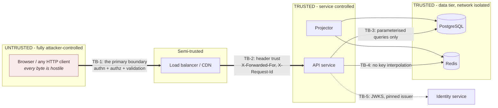

# Threat model — Scoreboard module

Requirement 5 — *"we want to prevent malicious users from increasing scores
without authorisation"* — is the requirement most likely to be answered with a
list of security features and a confident tone. This document does the opposite:
it enumerates what an attacker would actually try, states which attempts the
design stops, and states which ones it only makes more expensive.

Method: asset identification, trust boundaries, an attack tree for the primary
abuse case, STRIDE per component, then a threat catalogue with controls and
residual risk.

---

## 1. Assets, ranked by what an attacker wants

| # | Asset | Why it is worth attacking | Impact if compromised |
|---|-------|---------------------------|-----------------------|
| A1 | **A user's score** | It is the object of the competition | Fraudulent ranking; the board becomes worthless |
| A2 | **The ranking itself** | Visibility, status, whatever prize sits behind it | Loss of trust; unwinnable disputes |
| A3 | Action-token HMAC key | Forges unlimited valid awards for any user | **Total compromise of A1 and A2** |
| A4 | Access tokens / sessions | Score as another user, act as them elsewhere | Account takeover |
| A5 | The ledger | The audit trail and the ability to reverse fraud | Fraud becomes irreversible and undetectable |
| A6 | Service availability | Denying rivals the ability to score | Competitive advantage during an event |
| A7 | User display names, IPs | Enumeration, correlation, doxxing | Privacy breach; regulatory exposure |

A3 deserves particular attention. Every other compromise is bounded by one
account; a leaked HMAC key lets an attacker mint valid completion tokens for
*any* user, and because the resulting awards are indistinguishable from
legitimate ones in the ledger, there is no clean recovery short of invalidating
a time range of scores. Key handling (§5, T-14) is the highest-leverage control
in the module.

---

## 2. Trust boundaries

**TB-1 is the boundary that matters.** Everything arriving across it — body,
query, path, headers, tokens — is attacker-controlled. The design rule that
follows is the one in §8.1 of the specification: identity comes from the verified
token subject, and the point value comes from the server-side catalogue. Nothing
that crosses TB-1 is permitted to determine *who* is scored or *how much*.

**TB-2 is the boundary teams forget.** `X-Forwarded-For` is only trustworthy if
a proxy that overwrites it is definitely in front. Problem 5 already sets
`trust proxy` off by default for exactly this reason; the same default applies
here, and the consequence of getting it wrong is worse — an attacker who can
forge their apparent IP defeats the per-IP components of anomaly detection.

---

## 3. Attack tree — "increase my score without doing the work"

The primary abuse case. Leaf nodes are marked with whether the design stops
them.

```mermaid
flowchart TD
    ROOT["<b>GOAL: increase my score<br/>without doing the work</b>"]

    ROOT --> B1["Forge a request<br/>for someone else"]
    ROOT --> B2["Inflate my own<br/>award"]
    ROOT --> B3["Replay a legitimate<br/>award"]
    ROOT --> B4["Automate the<br/>real flow"]
    ROOT --> B5["Attack the stores<br/>directly"]
    ROOT --> B6["Degrade rivals<br/>instead"]

    B1 --> B1a["Send userId in the body<br/><b>BLOCKED</b> - schema rejects it"]
    B1 --> B1b["Steal a session token<br/><b>MITIGATED</b> - short TTL, TLS, no token in URLs"]
    B1 --> B1c["Forge a JWT<br/><b>BLOCKED</b> - asymmetric, alg whitelist"]
    B1 --> B1d["Use another user's action token<br/><b>BLOCKED</b> - sub binding + alert"]

    B2 --> B2a["Send points in the body<br/><b>BLOCKED</b> - server catalogue only"]
    B2 --> B2b["Claim a higher-value actionType<br/><b>BLOCKED</b> - type is inside the signed token"]
    B2 --> B2c["Tamper with the token payload<br/><b>BLOCKED</b> - HMAC"]

    B3 --> B3a["Resend a captured request<br/><b>BLOCKED</b> - single-use jti"]
    B3 --> B3b["Reuse an Idempotency-Key<br/><b>BLOCKED</b> - replays, awards once"]
    B3 --> B3c["Race N copies concurrently<br/><b>BLOCKED</b> - atomic DEL + unique index"]

    B4 --> B4a["Script: start then complete instantly<br/><b>BLOCKED</b> - minDurationMs"]
    B4 --> B4b["Script: start, wait, complete, loop<br/><b>RESIDUAL</b> - throttled + detected, not prevented"]
    B4 --> B4c["Many accounts (Sybil)<br/><b>OUT OF SCOPE</b> - identity service owns this"]

    B5 --> B5a["SQL injection<br/><b>BLOCKED</b> - parameterised, no dynamic columns"]
    B5 --> B5b["Write to Redis directly<br/><b>BLOCKED</b> - network isolation, AUTH; also non-durable"]
    B5 --> B5c["Steal the HMAC key<br/><b>CATASTROPHIC</b> - see T-14"]

    B6 --> B6a["Exhaust their rate limit<br/><b>BLOCKED</b> - keyed per user, not per IP"]
    B6 --> B6b["DoS the API<br/><b>MITIGATED</b> - limits, CDN, bounded work"]

    classDef blocked fill:#eaf2ea,stroke:#5c8a5c,color:#26321f
    classDef residual fill:#faf3e3,stroke:#a38a5c,color:#3a3226
    classDef severe fill:#f7ebeb,stroke:#a35c5c,color:#3a2626
    class B1a,B1c,B1d,B2a,B2b,B2c,B3a,B3b,B3c,B4a,B5a,B5b,B6a blocked
    class B1b,B4c,B6b residual
    class B4b,B5c severe
```

**Read the tree by its leaves, not its shape.** Every branch closes except two:
`B4b` — a script that drives the genuine flow at a plausible pace — and `B5c`,
key compromise. `B4b` is the residual risk that
[ADR-012](DECISIONS.md#adr-012-action-tokens-despite-not-solving-the-problem)
declares openly and that §14.1 of the specification is the real fix for. `B5c`
is a key-management problem, not an application-logic one.

---

## 4. STRIDE by component

| Component | S | T | R | I | D | E |
|-----------|---|---|---|---|---|---|
| `POST /score-increments` | JWT, asymmetric, alg whitelist | HMAC token; server-side points | Ledger with `requestId`, IP hash | Errors never echo tokens | Per-user rate + velocity limits | Identity from `sub` only; no admin path |
| `POST /actions/start` | JWT | `jti` from CSPRNG | Ledger | Token opaque | Rate limited; TTL bounds outstanding tokens | Type validated against catalogue |
| `GET /scoreboard/top` | n/a (public) | Read-only | Access log | Display names only, opt-out honoured | CDN + per-IP limit; no `limit` param | n/a |
| `GET /scoreboard/stream` | n/a (public) | Read-only | Connection log | Public data only | Per-instance and per-IP connection caps; backpressure | n/a |
| Projector | Internal only | Seq guard; idempotent | Outbox rows retained 7 d | No user data published beyond the board | `SKIP LOCKED`, batch bounds | Not network-exposed |
| PostgreSQL | Network isolated, `scram-sha-256` | Constraints; append-only ledger | Audit log | Least-privilege role | Connection pool bounds | No `PUBLIC` create |
| Redis | `AUTH`, isolated, dangerous commands removed | Lua atomicity | — | Non-durable, non-authoritative | `maxmemory` + `allkeys-lru` | — |

The PostgreSQL and Redis rows describe the hardening the repository-root Docker
stack already implements and `scripts/verify-infra.sh` already verifies —
`scram-sha-256`, revoked `PUBLIC` create privilege, Redis `AUTH` with
`CONFIG`/`FLUSHALL`/`FLUSHDB`/`DEBUG`/`MODULE` removed, loopback-only publishing.
That is a real starting position for this module rather than an aspiration.

---

## 5. Threat catalogue

Severity is pre-mitigation. "Residual" is what remains after the stated control.

### Spoofing and elevation

| ID | Threat | Sev | Control | Residual |
|----|--------|-----|---------|----------|
| **T-01** | `userId` supplied in the request body | **Critical** | Identity from `sub` only; schema rejects the field; enforced in three layers with a test per layer (§8.1) | **None** |
| **T-02** | Forged JWT — `alg: none`, RS256→HS256 confusion, unverified signature | **Critical** | Asymmetric only; algorithm **whitelist**, never read from the token; `iss`/`aud`/`exp`/`nbf` verified; JWKS by `kid` | **None** |
| **T-03** | Stolen access token | High | ≤15 min TTL; TLS + HSTS; never in a URL or log; refresh-token rotation is the identity service's responsibility | Attacker scores as the victim within the TTL |
| **T-04** | Another user's action token replayed with an attacker's own session | High | `sub` in the token must equal the authenticated user; mismatch is `403` **and an alert** — there is no innocent cause | **None**; and it is loud |
| **T-05** | Sybil accounts farming scores | Medium | Out of scope — the identity service owns account creation; per-account velocity budgets bound each one | Present, and correctly not this module's problem |

### Tampering

| ID | Threat | Sev | Control | Residual |
|----|--------|-----|---------|----------|
| **T-06** | `points` supplied by the client | **Critical** | Points come from `ActionCatalogue`; the field is rejected, not ignored (§8.2) | **None** |
| **T-07** | Higher-value `actionType` claimed at completion | High | The type lives *inside* the signed token, bound at issue time | **None** |
| **T-08** | Action-token payload edited | High | HMAC-SHA-256, constant-time comparison | **None** without the key (see T-14) |
| **T-09** | SQL injection | **Critical** | Parameterised queries throughout; no user input ever reaches a column or table name — unlike Problem 5's `sort`, this module has no dynamic identifiers at all | **None** |
| **T-10** | Redis key or Lua injection | Medium | Keys built from validated UUIDs; `KEYS`/`ARGV` only, never string-concatenated scripts | **None** |

### Repudiation and replay

| ID | Threat | Sev | Control | Residual |
|----|--------|-----|---------|----------|
| **T-11** | Captured request replayed | High | Single-use `jti` consumed by atomic `DEL`; `UNIQUE (action_token_jti)` as the durable backstop | **None** |
| **T-12** | Concurrent replay racing the consumption check | High | `DEL` returns 1 to exactly one caller; the unique index decides regardless | **None** |
| **T-13** | "I never scored that" / fraud cannot be traced | Medium | Append-only ledger with `requestId`, `jti`, action type, catalogue version, hashed IP, timestamp | **None** |

### Information disclosure and key compromise

| ID | Threat | Sev | Control | Residual |
|----|--------|-----|---------|----------|
| **T-14** | **HMAC key compromise** | **Critical** | Secret manager, never in source or an image; ≥32 bytes from a CSPRNG; rotation with `kid` and an overlap window; no default value, so the process refuses to boot without one | **Catastrophic if it occurs.** Detection: awards with no matching `/actions/start`. Response: rotate, then invalidate the affected time range from the ledger |
| **T-15** | Error responses leak whether a token was issued | Low | Uniform codes; the token is never echoed; internal detail logged, never returned | **None** |
| **T-16** | Board leaks PII | Medium | Display name and score only; `is_visible` opt-out applied by `ZREM`, so no filtered-out row can leak through a forgetful code path; IPs stored hashed | **None** |
| **T-17** | Board scraped to enumerate users | Low | Per-IP limits; only the top 10 is exposed; no paging API | Top 10 is public by design (A1) |

### Denial of service

| ID | Threat | Sev | Control | Residual |
|----|--------|-----|---------|----------|
| **T-18** | Flood of increment requests | Medium | Per-user rate limit before any storage or crypto work (§4.2); bounded body size | Absorbed |
| **T-19** | SSE connection exhaustion | Medium | Per-instance cap with `503` + `Retry-After`; per-IP cap; backpressure disconnects; jittered reconnect | Absorbed |
| **T-20** | Expensive read amplification | Medium | Pre-rendered snapshot; no `limit` parameter; CDN-cacheable | Absorbed |
| **T-21** | Redis outage used as a scoring window | High | Velocity budget **fails closed** ([ADR-011](DECISIONS.md#adr-011-rate-limiter-fails-open-velocity-budget-fails-closed)) | Write availability depends on Redis — accepted deliberately |

---

## 6. The residual risk, stated once, plainly

**A user who scripts the genuine flow — request a token, wait the minimum
duration, submit, repeat — will accumulate score.** The controls in this module
throttle that (velocity budget), make it expensive (one round trip per award,
enforced delay), and make it *visible* (§8.5 anomaly signals, and the
distinctive signature of intervals clustered at exactly `minDurationMs`). They
do not prevent it, and no control available at the API layer can, because the
server has no evidence about the action beyond the client's own claim.

This is not a gap in the implementation. It follows from requirement 4: the
client is the party that reports completion. Closing it requires the server to
determine the action's outcome rather than be told it —
[§14.1](../README.md#141-make-the-server-own-the-action-outcome) specifies that
change and how to reach it without a rewrite.

**Recommendation for the product owner:** until that change ships, do not attach
material value — prizes, money, irrevocable status — to leaderboard position.
The scores are good enough to be interesting and not good enough to be paid out
against, and the difference should be a decision rather than a discovery.

---

## 7. Verification

Each control above is required to have a test. The security section of
[§12 Definition of done](../README.md#12-definition-of-done) is that list, and
it deliberately asserts *outcomes* rather than mechanisms — for T-01, that the
other user's score is **unchanged**, not merely that the request returned `400`.
A test that checks the status code alone passes against an implementation that
returns `400` and awards the points anyway.

Recommended beyond the test suite:

- Dependency scanning in CI (`npm audit` at zero, as Problems 4 and 5 hold).
- Static analysis for the T-01/T-06 pattern — a lint rule that fails the build
  on `req.body.userId` or `req.body.points` anywhere in the module.
- An adversarial review of the write path before the module handles anything of
  value, and a penetration test focused on the two-step action flow specifically.
